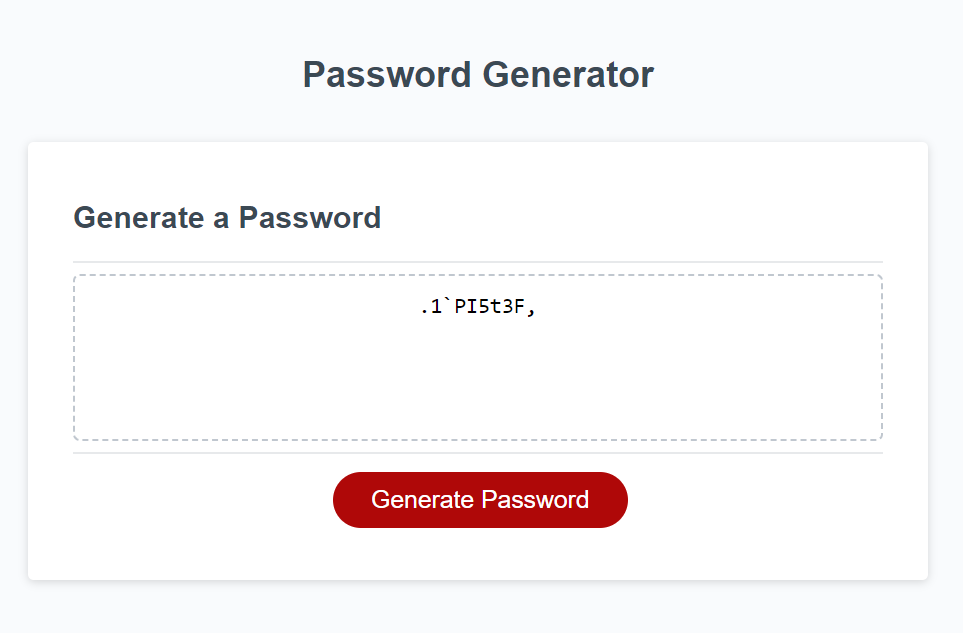

# Password Generator

## This application was created to help users create a random password whenever needed. It lets the user select what type of characters are required for the password as well as their preferred length. 

## Screenshot
 

## Usage
When a user presses the "Generate Password" button, the site will then prompt them to confirm a length and reply yes or no to whether various character types will be included in the final password. Once all choices have been made, it will output the final password to be used as desired.

## Future Developments
In the future I would like to change the prompt responses to "Yes" and "No" instead of the JS default "OK" and "Cancel". I would also like to add a built-in "copy to clipboard" feature to create a smoother user experience.

## License
MIT Standard License